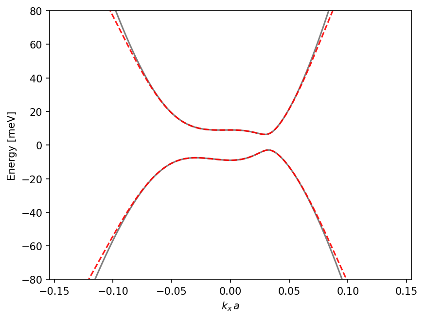
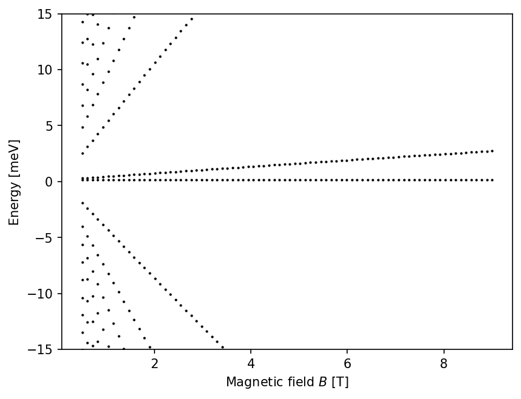
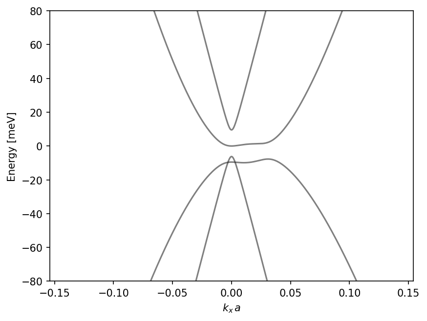

# Example Notebooks

The `contimod_graphene` package comes with several Jupyter notebooks in the `examples/` directory that demonstrate its functionality. This page distills them into a few compact, self‑contained examples and shows the corresponding figure output.

All examples below can be copied into a Python script or Jupyter notebook and run directly (assuming `contimod_graphene` and the listed dependencies are installed).

## 1. Rhombohedral (ABC) Band Structures (`bandstructure_plots.ipynb`)

This notebook demonstrates how to calculate and plot zero‑field electronic band structures for Rhombohedral (ABC) graphene. A common workflow is to compare the full tight‑binding model with its low‑energy 2‑band approximation.

The figure below shows an example band structure for ABC trilayer graphene with an interlayer bias:



**Example: full vs 2‑band model for ABC trilayer**

```python
import jax
import jax.numpy as jnp
import matplotlib.pyplot as plt
import contimod_graphene as cm_graphene

# Start from the built-in trilayer parameters and add an interlayer bias
params = cm_graphene.GrapheneTBParameters.preset("tlg").replace(U=10.0)
model = cm_graphene.RhombohedralMultilayer(n_layers=3, params=params)

# Full and effective 2-band Hamiltonians
h_full = lambda kx, ky: model.hamiltonian(kx, ky)
h_low = lambda kx, ky: model.two_band_hamiltonian(kx, ky)

# 1D k-path along kx
k_lin = 0.28 * jnp.linspace(-0.5, 0.5, 400)
ks = jnp.stack([k_lin, jnp.zeros_like(k_lin)], axis=-1)

# Evaluate H(k) and diagonalize
Hs_full = jax.vmap(h_full, in_axes=(0, 0))(*ks.T)
bands_full = jnp.linalg.eigvalsh(Hs_full)

Hs_low = jax.vmap(h_low, in_axes=(0, 0))(*ks.T)
bands_low = jnp.linalg.eigvalsh(Hs_low)

fig, ax = plt.subplots()
for band in bands_full.T:
    ax.plot(k_lin, band, color="black", linewidth=1.5, alpha=0.5)
for band in bands_low.T:
    ax.plot(k_lin, band, color="red", linewidth=1.5, linestyle="--", alpha=0.9)

ax.set_xlabel(r"$k_x\,a$")
ax.set_ylabel("Energy [meV]")
ax.set_ylim(-80, 80)
plt.show()
```

## 2. Landau Level Fan Diagrams (`landau_level_fans.ipynb`)

This notebook illustrates how to calculate Landau levels (LLs) in the presence of a perpendicular magnetic field and visualize them as "fan diagrams" (energy vs magnetic field).

The following figure shows a typical LL fan for bilayer graphene:



**Example: LL fan for bilayer graphene**

For `n_layers=2`, the Bernal and rhombohedral kernels describe the same AB bilayer connectivity, so using the rhombohedral LL helper with the BLG preset here is intentional.

```python
import jax
import jax.numpy as jnp
import matplotlib.pyplot as plt
import contimod_graphene as cm_graphene

# Bilayer parameters and LL Hamiltonian
params = cm_graphene.GrapheneTBParameters.preset("blg").replace(U=0.0)
model = cm_graphene.RhombohedralMultilayer(n_layers=2, params=params)

# Magnetic field range
B_values = jnp.linspace(0.5, 9.0, 80)  # Tesla

eigvals = []
for B in B_values:
    H = model.landau_level_hamiltonian(B, n_cut=40)
    e, _ = jnp.linalg.eigh(H)
    eigvals.append(e)

# Plot LL fan diagram
fig, ax = plt.subplots()
for B, e in zip(B_values, eigvals):
    ax.plot(jnp.full_like(e, B), e, "k.", ms=2)

ax.set_xlabel(r"Magnetic field $B$ [T]")
ax.set_ylabel("Energy [meV]")
ax.set_ylim(-15, 15)
plt.show()
```

## 3. Bernal (ABA) Stacking Analysis (`bernal_bands_LL.ipynb`)

This notebook focuses on Bernal (ABA) stacked graphene and demonstrates how to compute zero‑field band structures for different layer numbers using the `contimod_graphene.bernal` module.

The figure below shows the band structure of ABA trilayer graphene:



**Example: zero‑field bands for ABA trilayer**

```python
import jax
import jax.numpy as jnp
import matplotlib.pyplot as plt
import contimod_graphene as cm_graphene

# Custom Bernal parameters (see bernal_bands_LL.ipynb)
graphene_params_ABA = {
    "gamma0": 3100,
    "gamma1": 370,
    "gamma2": -19,
    "gamma3": 315,
    "gamma4": 140,
    "gamma5": 20,
    "U": 0.0,
    "Delta": 18.5,
    "delta": 3.8,
}

# Common k-path
k_lin = 0.28 * jnp.linspace(-0.5, 0.5, 400)
ks = jnp.stack([k_lin, jnp.zeros_like(k_lin)], axis=-1)

# ABA trilayer Hamiltonian and bands
params_aba = cm_graphene.GrapheneTBParameters.from_dict(graphene_params_ABA)
model_aba = cm_graphene.BernalMultilayer(n_layers=3, params=params_aba)

Hs = model_aba.hamiltonian_batch(ks)
bands = jnp.linalg.eigvalsh(Hs)

fig, ax = plt.subplots()
for band in bands.T:
    ax.plot(k_lin, band, color="black", linewidth=1.5, alpha=0.5)

ax.set_xlabel(r"$k_x\,a$")
ax.set_ylabel("Energy [meV]")
ax.set_ylim(-80, 80)
plt.show()
```

## 4. Integration with Contimod (`contimod_example.ipynb`)

This advanced notebook shows how `contimod_graphene` can be used as a model provider for the broader `contimod` package. It demonstrates many‑body quantities such as the charge susceptibility on a 2D momentum mesh.

> Note: The snippet below assumes that the external `contimod` package is installed.

**Example: building a `contimod` Hamiltonian and computing $\chi(q,\omega)$**

```python
import contimod as cm
import contimod_graphene as cmg
import jax
import jax.scipy as jsp

# Valley-projected trilayer Hamiltonian
params = cmg.GrapheneTBParameters.preset("tlg").replace(U=62.0)
model = cmg.RhombohedralMultilayer(n_layers=3, params=params)

# Include valley degree of freedom via a block-diagonal Hamiltonian
h_full = lambda kx, ky: jsp.linalg.block_diag(
    model.hamiltonian(kx, ky),
    model.hamiltonian(-kx, -ky).conj(),
)

# Construct a k-mesh and evaluate H(k)
kMesh = cm.hamiltonian_meshgrid.kMeshgrid2D(0.28, 251)
Hs = jax.vmap(jax.vmap(h_full))(*kMesh.ks.T)

# Wrap into a Contimod Hamiltonian object
h0 = cm.hamiltonian_meshgrid.DiscretizedHamiltonianMeshgrid(
    kMesh, Hs, projected_dims=4, T=0.1, chemicalpotential=-31
)

# Example: static charge susceptibility
chi_static = h0.get_chargesusceptibility(omega=0.0, broadening=0.01)
```
